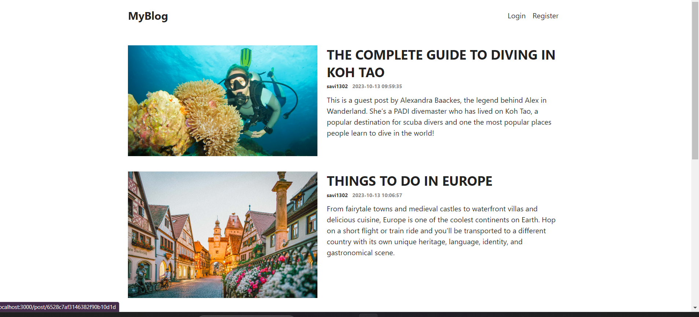
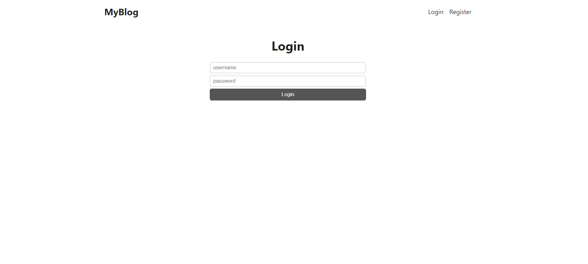
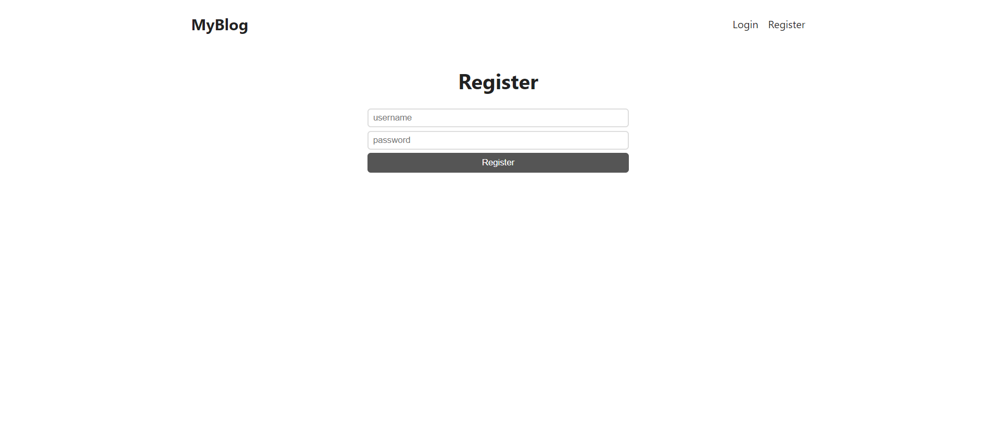

# BLOG
## Key Features


- User Login & Registration
- Password hashing
- Authorization using JWT web tokens
- Create, update, display blog

  ## Images
  
  
  
  

  ## How To Use

To clone and run this application, you'll need [Git](https://git-scm.com) and [Node.js](https://nodejs.org/en/download/) (which comes with [npm](http://npmjs.com)) installed on your computer. From your command line:

```bash
# Clone this repository
$ git clone https://github.com/ack13/BLOG

# Go into the repository
$ cd api

# Go into the repository
$ cd client

# Install dependencies in backend by using 
$ npm install (wait 5mins)

# Install the frontend dependencies by using 
$ yarn install (wait 5mins)

# Run the backend
$cd backend
$ npm start

# Run the frontend by setting proxy to frontend in package.json
# Run the frontend
$cd frontend
$ yarn start
```

## Credits

This software uses the following open source packages:

- [NodeJS](http://nodejs.org)
- [ReactJS](http://reactjs.org)
- [ExpressJS](http://expressjs.com)
- [MongoDB](http://mongodb.com)


